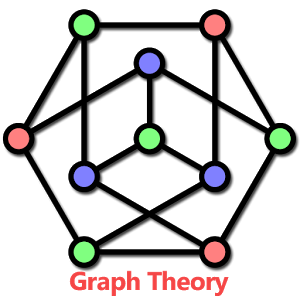
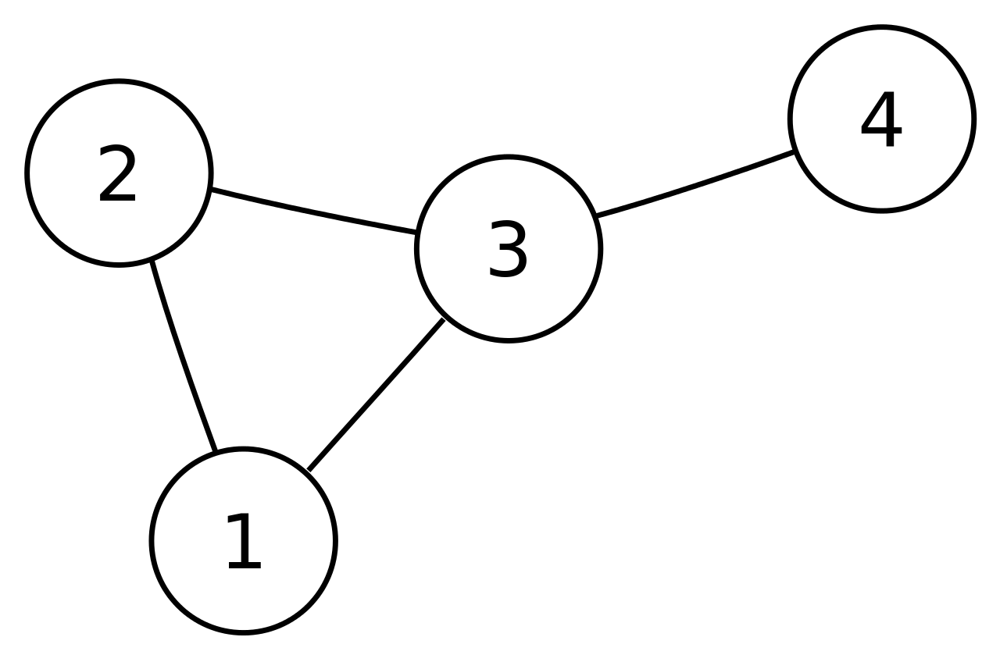
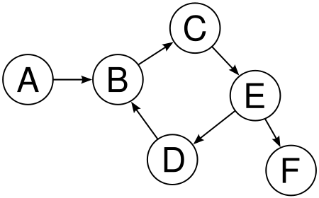
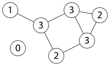
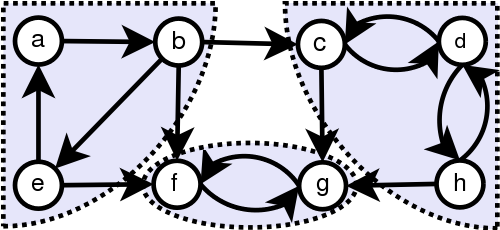
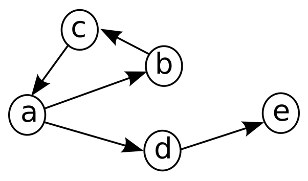

# Graph Algorithms :fire: :fire:

C++ implementations of various graph algorithms such as: Graph Traversals
(BFS, DFS), Topological Sort, Shortest Path, and Minimum Spanning Trees.

## Purpose

I wrote my own implementations of these graph algorithms to better understand
how graph algorithms work.

Graph theory is one of the fundamental concepts in Computer Science and often
show up in technical interviews. I wrote this with the intent for people
to study and review the implementations of such algorithms. I've also written
up the high level idea and included the run times with explanations.

This repository contains everything you could be tested with regards to
graph theory in a technical interview.

## Introduction to Graphs

### Basic Definition
* A graph, *G* is an ordered pair of the form, `G = (V, E)` where *V* is a set
of vertices and *E* is a set of edges through which vertices are connected.
A graph may be _directed_ or _undirected_.

Here is an example of a simple undirected graph:

Here is a simple directed graph:

### Sparse vs Dense Graphs

If _|E| ≈ |V|2_ (which is the maximum number of edges in a graph),
then the graph is said to be **dense**

If _|E| ≈ |V|_, then the graph is said to be **sparse**

### Connectivity of Graphs

* A graph is said to be **connected** if there exists a path between every pair
of vertices in the graph.

Here is a connected graph:

* A graph is said to be **strongly connected** if every vertex can be reached
from every other vertex.

Here is a strongly connected graph:

### Cycles in Graphs

A directed graph is said to be **acyclic** if there are no loops within the
directed graph.

Here is an example of a directed graph:

### Breadth First Search (BFS):

BFS is one of the most common and widely used traversing algorithms for graphs.
As the name suggests, you traverse the graph in layers. Start BFS from an
arbitrary vertex thus exploring its neighboring nodes. Continue to do this till
you have traversed all of the vertices in the graph. The fundamental idea behind
a BFS traversal is that you must visit the vertex exactly once! To do this, just
mark which vertex you have visited and which one's you haven't using an array.
To visit neighboring vertices, we make use of a queue. Since we enqueue each
vertex at most once, the overall time complexity is *O(|V| + |E|)*.

### Depth First Search (DFS):

Depth First Search is one of the most common recursive algorithm for graph
traversals. The idea behind DFS is to go as far as possible and then backtrack.
Once you have reached a vertex with no more neighbors that are unvisited, you
go backwards to find a vertex that still has unvisited neighbors.

If you're not a fan of recursion, the DFS algorithm can be implemented by just
altering the BFS code. Instead of using a queue, you would use a stack.
The LIFO feature of a stack allows us to go as far as possible and then lets us
backtrack. Graph traversals really depend on the data structure you use.
The overall time complexity remains the same - *O(|V| + |E|)*.

### Topological Sort:

The topological sort is an algorithm that "sorts" vertices only in a
***Directed Acyclic Graph***. We make use of the concept of in-degree for each
vertex to implement the topological sort algorithm. The basic idea of the
algorithm is that if there is a vertex **A** with 0 in-degree and is *directed*
to another vertex **B**, then **A** comes before **B** in the graph.

The algorithm is implemented using a simple BFS traversal with the added
condition that the vertex is enqueued only if the in-degree is 0. Since a BFS
traversal is used, the overall time complexity is simply *O(|V| + |E|)*.

### Shortest Path using BFS:

The shortest path between two vertices in a graph is a path such that the total
sum of edge weights in the path connecting the two vertices is minimum. If we
are given a graph with constant edge weights, then we can just use BFS to solve
the problem.

However, practical problems have varying edge weights and thus,
we need to make use of more complex algorithms.
One such algorithm is ***Dijkstra's Algorithm***

### Dijkstra's Algorithm:

Dijkstra's algorithm is arguably one of the most common algorithm used to find
the shortest path between the source vertex to every other vertex in the graph.
The most common data structure used to implement this algorithm is a
min-priority queue. As we enqueue each unvisited vertex, we pop from the
priority queue according to the minimum weight (This technique is also known as
a greedy algorithm). We push onto the priority queue if we can find a better
path (smaller edge weight). The overall time complexity of Dijkstra's algorithm
is *O(V2)* but is reduced to
*O(|V| + |E|log|V|)* when implemented using a min-priority queue.

### Minimum Spanning Trees (MST):

A spanning tree is essentially a tree that connects all the vertices in a graph
and is a subgraph of the original graph, G. A minimum spanning tree on the other
hand is a tree that connects all vertices in a graph with a minimum cost
(or minimum edge weights). One of the most common algorithm to find the MST of a
graph is ***Prim's Algorithm***. In this algorithm, we make use of a priority
queue. The algorithm works very similar to Dijkstra's algorithm but does not
make use of a cumulative edge weight. As we visit every vertex, we pick the edge
that has the minimum weight from that vertex and we add it to the spanning tree.
As this algorithm makes use of a min-priority queue,
the overall time complexity is *O(|V| + |E|log|V|)*.

## Time Complexity Cheatsheet

| Algorithm 						| Time Complexity     				| Notes     			|
| :------------- 					| :------------- 					|	:------------- 		|
| **BFS** 							| *O(V + E)*						|	Uses a queue					|
| **DFS** 							| *O(V + E)*						|	Uses a stack					|
| **Topological Sort** 				| *O(V + E)*						| Use when graph is a _DAG_					|
| **Dijkstra's Algorithm** 			| *O(V + ElogV)*						|Implemented using a min priority queue|
| **Prim's Algorithm** 				| *O(V + ElogV)*						|Implemented using a min priority queue|

## References

* GIFs are taken from [here](https://github.com/kdn251/interviews).
